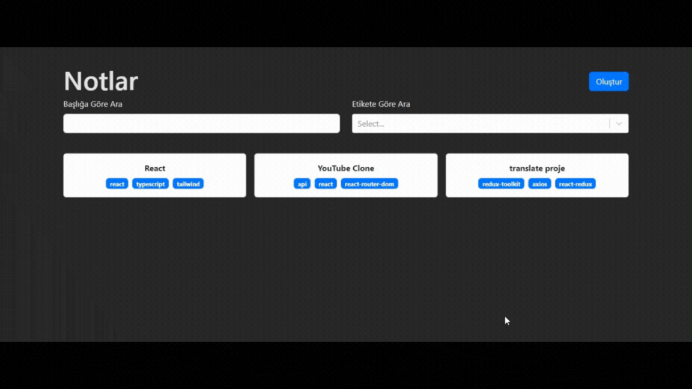

## Not Yönetim Uygulaması
- Bu proje, kullanıcılara not oluşturma, düzenleme, silme ve notlar arasında filtreleme yapma işlevselliği sunar. Kullanıcılar, Bootstrap ile şekillendirilmiş modern ve kullanıcı dostu bir arayüz aracılığıyla notlarını kolayca yönetebilirler.

## Kullanılan Teknolojiler
- React: Kullanıcı arayüzünü oluşturan temel kütüphane.
- React DOM: React bileşenlerini DOM'a render etme işlevi.
- React Router DOM: Uygulamada yönlendirmeyi sağlayan kütüphane.
- React Bootstrap: Bootstrap bileşenlerini React ile kolayca kullanmak için.
- Bootstrap: Arayüzde modern ve responsive bir tasarım sunmak için.
- React Markdown: Not içeriğini Markdown formatında göstermek için.
- React Select: Kullanıcıların notları filtreleyebileceği bir select kutusu sağlamak için.
- UUID: Notlara benzersiz kimlikler atamak için.
- @uidotdev/usehooks: Çeşitli kullanışlı hook fonksiyonlarını sağlamak için.

## ScreenCast
